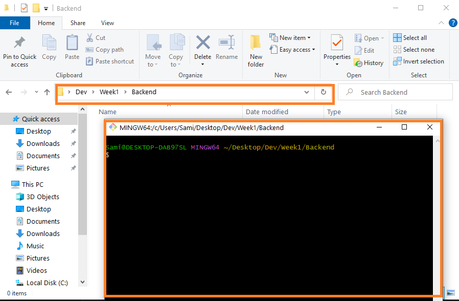

#

# README

Before staring activity make sure, that 

### 1. You have the following hierarchy:

```sh
Dev
└── week1
    ├── Frontend
    ├── Backend
    └── Project
```
- This activity will be carried in the Backend folder


### Node.JS

Make sure that Node is installed. Here are the [Instructions]

### 3. **For windows' users** 

Make sure that you Installed Git Bash:
  -  If you haven't already, download and install Git for your operating system. Git Bash is included with the Git installation on Windows.
  - Launch Git Bash. It will provide you with a terminal-like interface where you can enter commands.




<!-- Links -->
[Instructions]:https://github.com/tx00-web/labs/tree/main/proj-unified-setup
